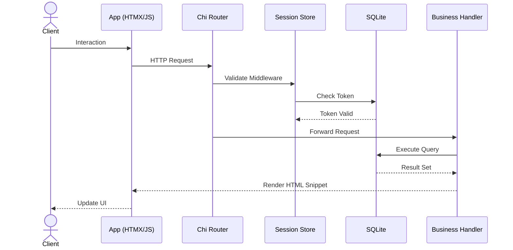
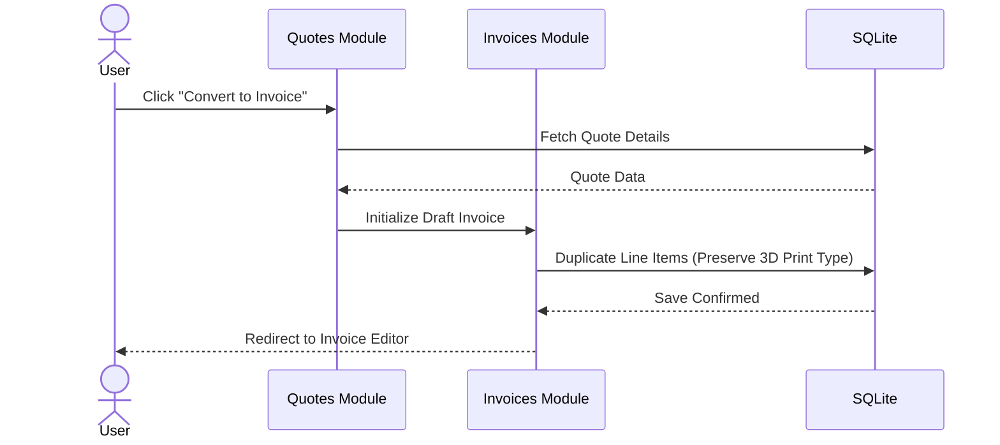
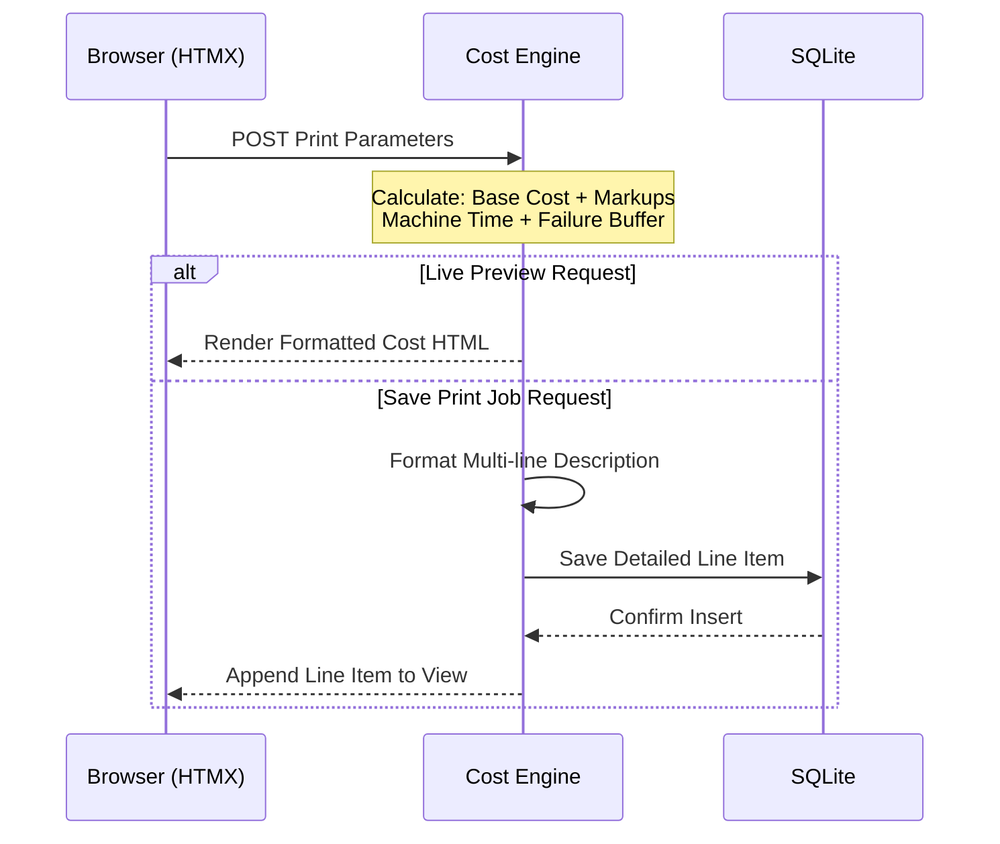
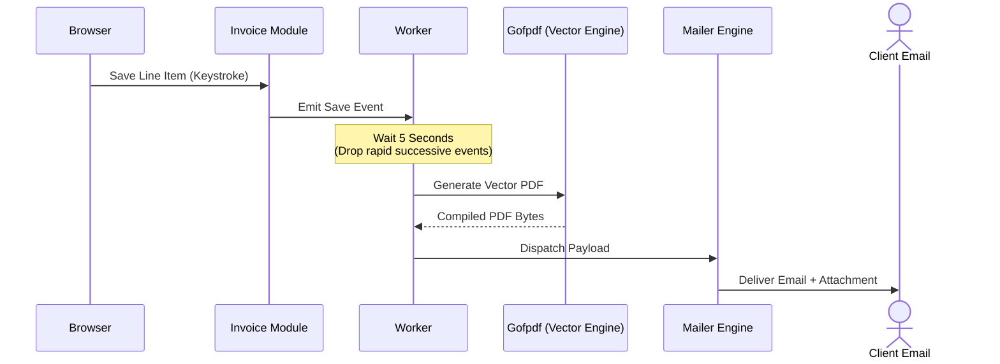

### **1. High-Level System Architecture**

This diagram focuses strictly on system boundaries, logical grouping, and the primary flow of data. Implementation details and workflows have been abstracted away to provide a clean 30-second overview of the stack.

```mermaid
flowchart TD
    classDef frontend fill:#3b82f6,color:#fff,stroke:#1d4ed8,stroke-width:2px
    classDef core fill:#8b5cf6,color:#fff,stroke:#6d28d9,stroke-width:2px
    classDef module fill:#10b981,color:#fff,stroke:#047857,stroke-width:2px
    classDef engine fill:#f59e0b,color:#fff,stroke:#d97706,stroke-width:2px
    classDef storage fill:#64748b,color:#fff,stroke:#475569,stroke-width:2px

    Browser[Client UI <br> PicoCSS / Alpine / HTMX]:::frontend
    
    subgraph Core Server [Go Backend]
        Router[Chi Router & Middleware]:::core
        Auth[Session Store]:::core
    end
    
    subgraph Business Modules
        CRM[Clients]:::module
        Billing[Quotes / Invoices / Payments]:::module
        Dash[Dashboard Aggregator]:::module
    end
    
    subgraph Technical Engines
        Calc[3D Cost Calculator]:::engine
        PDF[PDF Renderer]:::engine
        Mail[SMTP Mailer]:::engine
        Workers[Background Workers]:::engine
    end

    DB[(SQLite WAL)]:::storage

    Browser -->|HTTP Requests| Router
    Router -->|Authenticate| Auth
    Router -->|Route to| Business Modules
    
    Business Modules -->|Trigger| Technical Engines
    Business Modules <-->|Read / Write| DB
    Technical Engines -.->|Read / Write| DB
    Auth <-->|Verify| DB

```

---

### **2. Request Lifecycle & Authentication Flow**

Instead of mapping every single router connection to a database node, this sequence diagram explains the general pattern every request follows.



---

### **3. Quote to Invoice Conversion**

This abstracts the "1-Click Convert" logic into a dedicated process flow, showing exactly how state is transferred from an estimate to a billable entity.



---

### **4. 3D Print Cost Calculation Flow**

The cost calculator serves two distinct purposes: generating a live UI preview and officially logging a print job. This sequence diagram clarifies that dual behavior.



---

### **5. PDF Generation & Debounced Mailer Workflow**

Debouncing and background processing are captures of timing mechanisms and background hand-offs.

